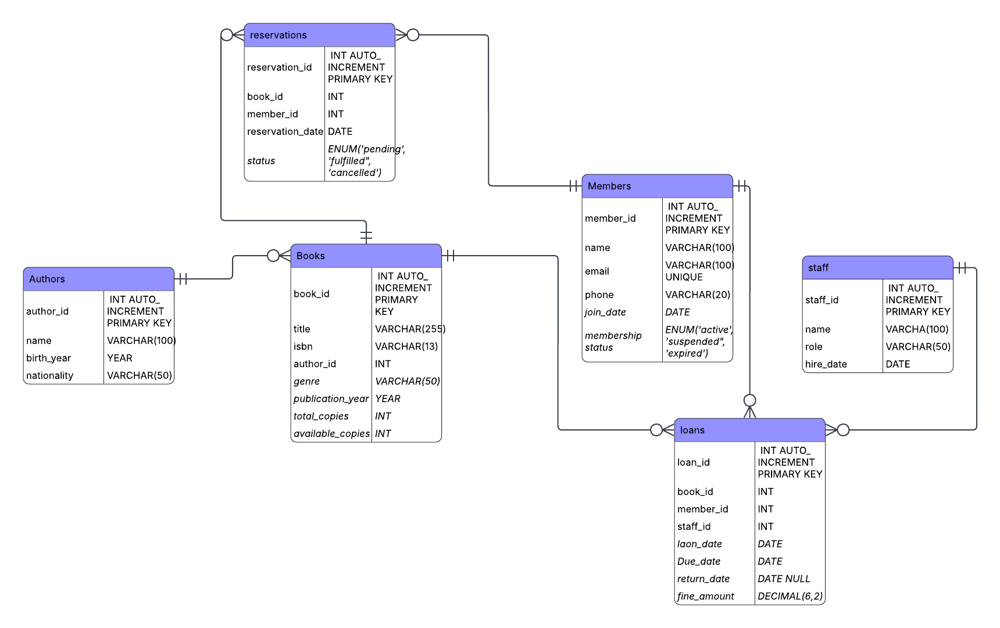

# Library Database — MySQL Capstone Project

A fully normalized relational database for a library system that tracks books, members, borrowing activity, and staff. Built with MySQL, this project covers schema design, data population, analytical queries, views, stored procedures, and triggers.

---

## Table of Contents

- [ER Diagram](#er-diagram)
- [Schema Overview](#schema-overview)
- [Phase 1 — Requirements & Schema Design](#phase-1--requirements--schema-design)
- [Phase 2 — Build the Schema](#phase-2--build-the-schema)
- [Phase 3 — Populate with Data](#phase-3--populate-with-data)
- [Phase 4 — Core Queries](#phase-4--core-queries)
- [Phase 5 — Advanced Features](#phase-5--advanced-features)
- [Phase 6 — Wrap-Up](#phase-6--wrap-up)

---

## ER Diagram



---

## Schema Overview

| Table | Description |
|---|---|
| `authors` | Book authors with biographical info |
| `books` | Catalog with availability tracking |
| `members` | Library cardholders and membership status |
| `staff` | Employees who process loans |
| `loans` | Borrowing records with fine tracking |
| `reservations` | Book holds placed by members |

---

## Phase 1 — Requirements & Schema Design

Design tables for the following entities:

```
authors       (author_id, name, birth_year, nationality)
books         (book_id, title, isbn, author_id FK, genre, publication_year, total_copies, available_copies)
members       (member_id, name, email, phone, join_date, membership_status)
staff         (staff_id, name, role, hire_date)
loans         (loan_id, book_id FK, member_id FK, staff_id FK, loan_date, due_date, return_date, fine_amount)
reservations  (reservation_id, book_id FK, member_id FK, reservation_date, status)
```

Before writing SQL, sketch an ER diagram (paper, [draw.io](https://draw.io), or [dbdiagram.io](https://dbdiagram.io)) showing relationships and cardinality:
- `authors` → `books` (one-to-many)
- `members` → `loans` (one-to-many)
- `books` → `loans` (one-to-many)

---

## Phase 2 — Build the Schema

- Write `CREATE DATABASE` and `CREATE TABLE` statements with proper data types
- Add constraints: `PRIMARY KEY`, `FOREIGN KEY`, `NOT NULL`, `UNIQUE` (on `isbn`, `email`), `CHECK` (e.g. `available_copies >= 0`)
- Add indexes on frequently searched columns: `isbn`, `email`, `due_date`

---

## Phase 3 — Populate with Data

Insert at least:

| Entity | Minimum Rows |
|---|---|
| Authors | 15 |
| Books | 30 |
| Members | 20 |
| Staff | 5 |
| Loans | 50 (mix of returned, active, and overdue) |
| Reservations | 10 |

> **Tip:** Use a data generation tool or script to create realistic `INSERT` statements faster than writing them by hand.

---

## Phase 4 — Core Queries

Write and test all of the following:

1. List all books currently checked out, with member name and due date
2. Find all overdue loans and calculate fines (e.g. $0.50/day late)
3. Top 5 most borrowed books
4. Members who haven't returned a book in over 30 days
5. Total books borrowed per genre
6. Authors with more than 2 books in the library
7. Members with zero loans ever (using `LEFT JOIN`)
8. Monthly loan trends (loans grouped by month)
9. Books currently available vs. fully checked out
10. Staff member who has processed the most loans

---

## Phase 5 — Advanced Features

### Views
- `current_overdue_loans` — live view of all overdue loans

### Stored Procedures
- `CheckoutBook(member_id, book_id, staff_id)` — validates availability, inserts a loan record, decrements `available_copies`
- `ReturnBook(loan_id)` — sets `return_date`, calculates fine if late, increments `available_copies`

### Triggers
- Prevent checkout if `available_copies = 0`
- Auto-update `membership_status` to `'suspended'` when a member has 3 or more unpaid fines

---

## Phase 6 — Wrap-Up

- Write a short summary explaining schema decisions and any tradeoffs made
- Export the schema as a `.sql` file via `mysqldump` for portability
